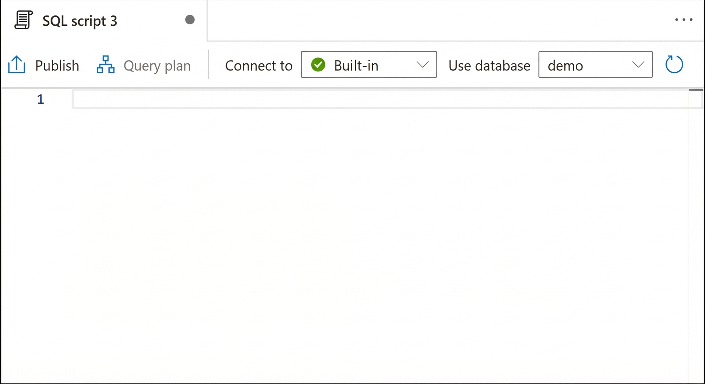
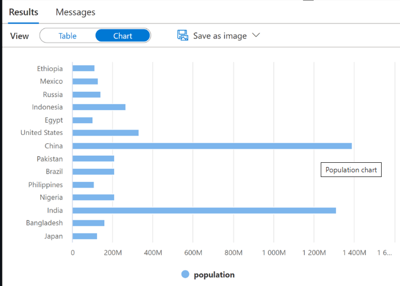

# Lab 03: Run Interactive Queries Using Serverless SQL Pools

In this lab, I worked with files stored in the data lake and external file sources using T-SQL statements executed by a serverless SQL pool in Azure Synapse Analytics. I also configured security using Azure Active Directory groups, RBAC, and ACLs.

---

## Exercise 1: Querying a Data Lake Store using serverless SQL pools

### Task 1: Query sales Parquet data with serverless SQL pools
- Opened Synapse Studio and navigated to the Data hub.

- Explored the ADLS Gen2 account and selected the Parquet file for querying.

- Ran a query to select the top 100 rows and performed aggregate operations.

- Verified the output.

- Modified the SQL query to perform aggregates and grouping operations.

- Ran a query to count all records in 2019 Parquet files.

### Task 2: Create an external table for 2019 sales data
- Created an external table for Parquet files in the data lake.

- Connected to the serverless SQL pool and ran the script.

- Verified the output.

### Task 3: Create an external table for CSV files
- Created a master key, credential, external data source, and external file format for CSV files.

- Ran queries to filter population data and viewed results as a chart.

### Task 4: Create a view with a serverless SQL pool
- Created a view to wrap a SQL query for easier access and integration with tools like Power BI.

- Ran the script and verified the results.

- Updated the script to use FIRSTROW=2 and selected from the view.

- Ensured demo database is selected and ran the script.

- Refreshed the workspace and expanded the demo SQL database.

---

## Exercise 2: Securing Access to Data

### Task 1: Create Azure Active Directory security groups
- Created security groups for history owners, readers, current writers, and 2019 writers.

### Task 2: Add group members
- Added my account and other groups as members to the security groups.

### Task 3: Configure data lake security - RBAC
- Assigned Storage Blob Data Reader and Owner roles to the security groups.

### Task 4: Configure data lake security - ACLs
- Set ACLs for the Year=2019 folder to control access and permissions.

### Task 5: Test permissions
- Tested read and write permissions using SQL and Spark notebooks.

---

*Screenshots are attached for each major step to showcase my hands-on work and troubleshooting skills.*
