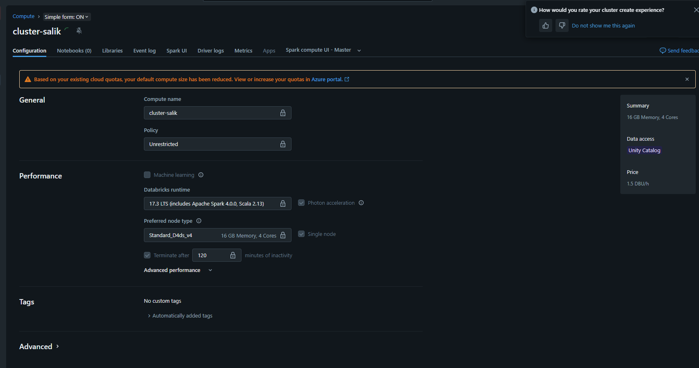
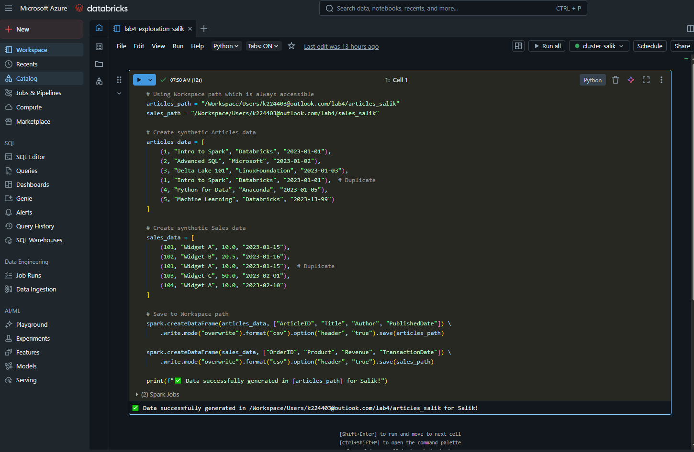
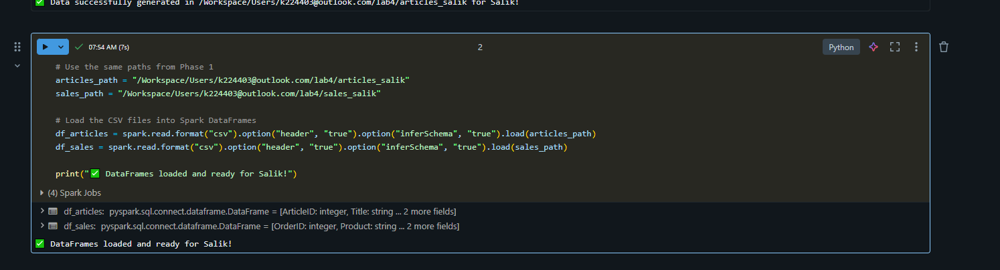
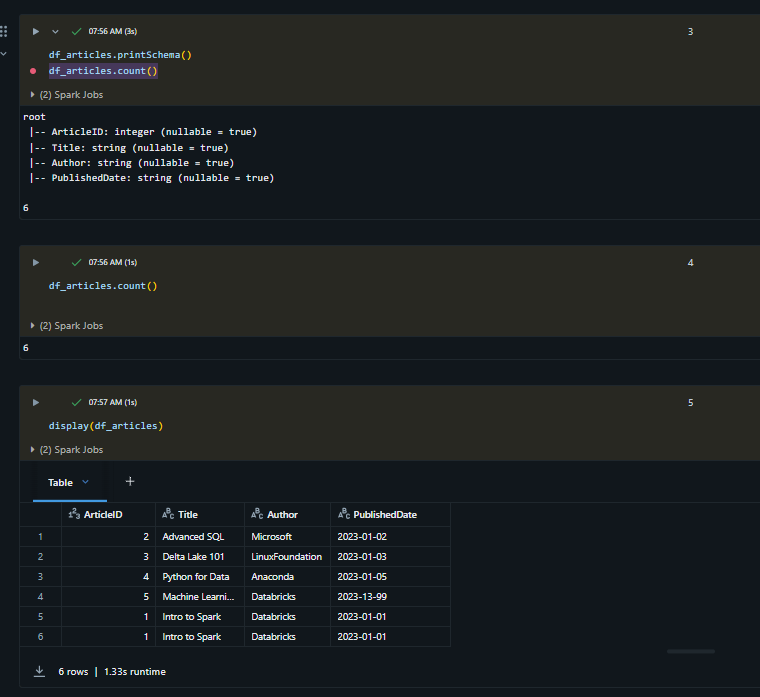
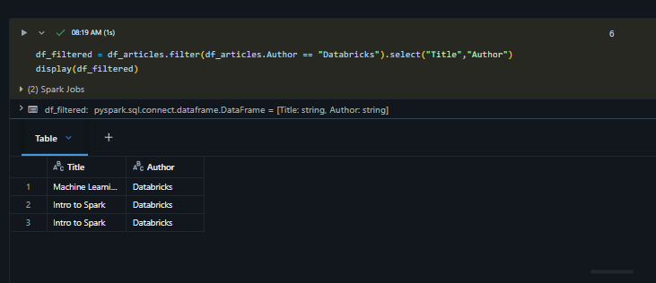
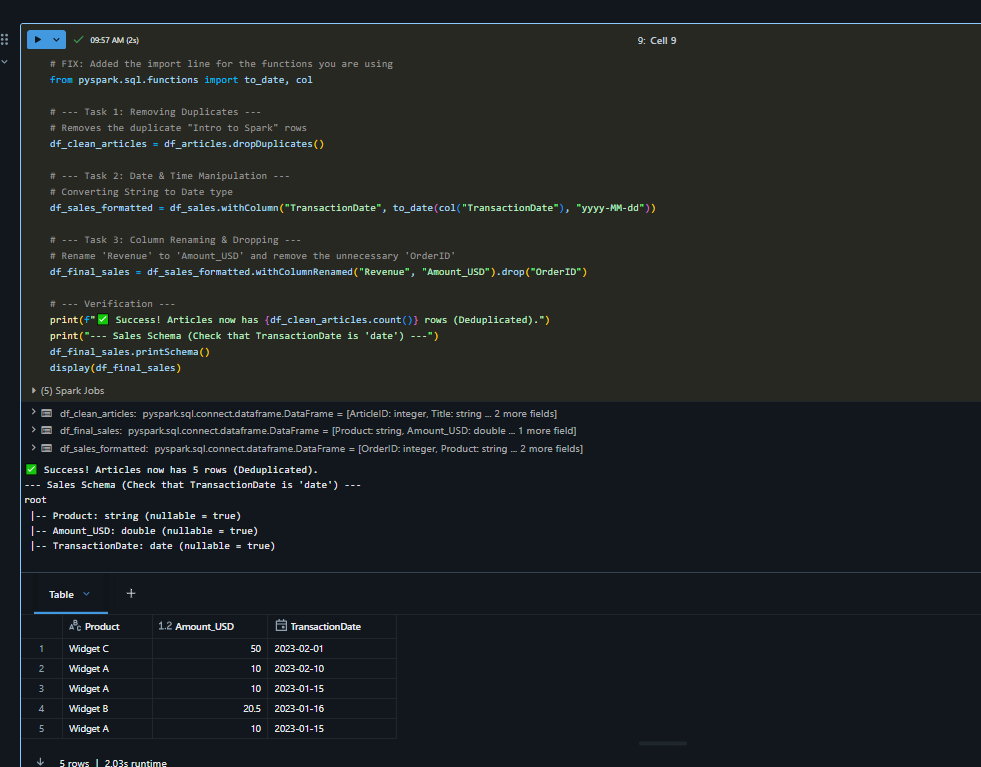
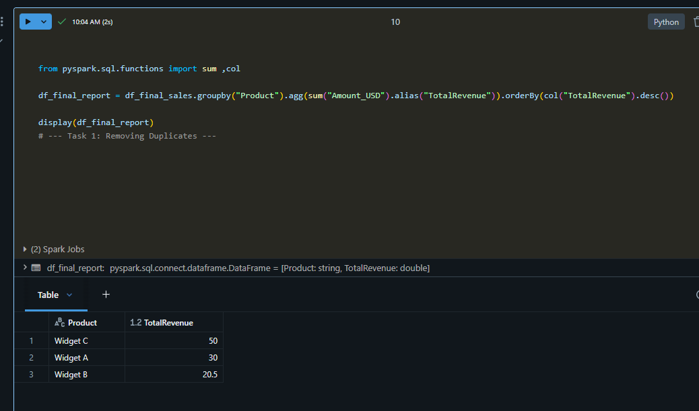

# Lab 4: Data Exploration and Transformation in Azure Databricks

🎯 **Lab Goal**
The objective of this lab was to utilize Apache Spark to process raw datasets, focusing on data cleaning, schema enforcement, and business logic aggregation.

---

## 🛠️ Phase 1: Environment & Data Generation
A single-node cluster named `cluster-salik` was deployed using 17.3 LTS (Spark 3.5.0). Due to the original lab files being archived, synthetic datasets for articles and sales were generated via a Python script and stored in a secure workspace directory.

**Screenshots:**

---

## 🔍 Phase 2: Initial Exploration
The data was loaded into Spark DataFrames with inferSchema enabled.

- **Articles Count:** 6 rows.
- **Filtering:** Successfully isolated articles authored by "Databricks".

**Screenshots:**

---

## 🧼 Phase 3: Data Engineering & Cleaning
To prepare the data for reporting, the following transformations were applied:

- **Deduplication:** Removed redundant entries, reducing the article count to 5.
- **Casting:** Converted the TransactionDate column from string to date.
- **Renaming:** Updated the Revenue column to Amount_USD for clarity.

**Screenshot:**

---

## 📊 Phase 4: Final Analytics Report
The final stage involved grouping the sales data by Product and calculating the total revenue sum.

- **Widget C:** Top performer with a total revenue of 50.
- **Widget A:** Correctly aggregated to 30 from multiple smaller transactions.

**Screenshot:**

---

## 🛑 Resource Management
The lab was concluded by manually terminating the compute cluster to prevent unnecessary Azure credit consumption.

**Screenshot:**

