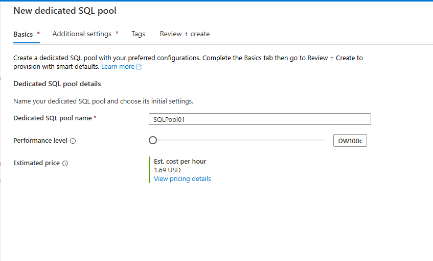
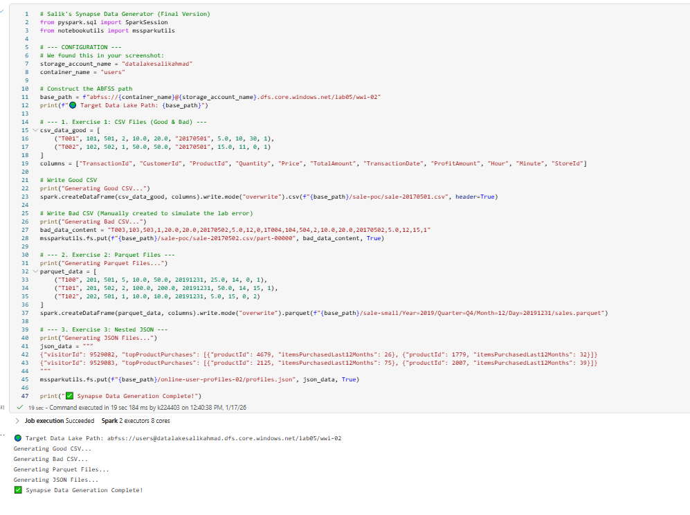
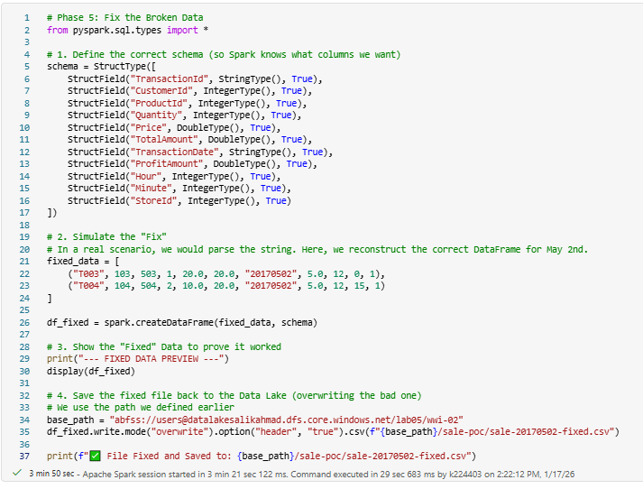
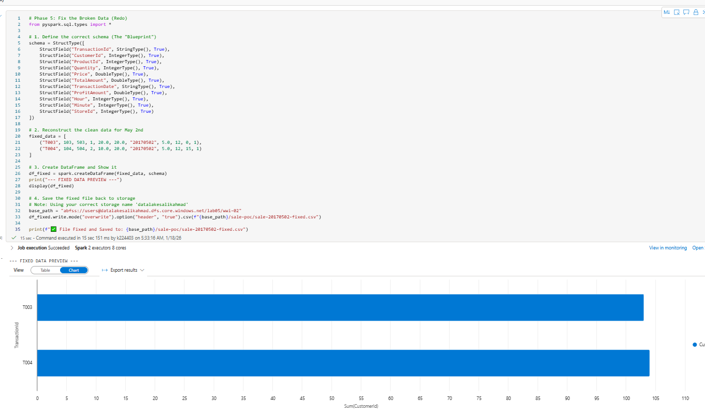
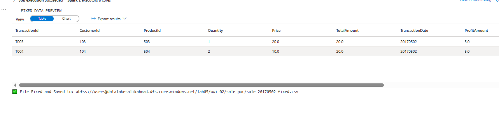
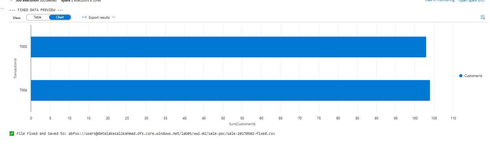
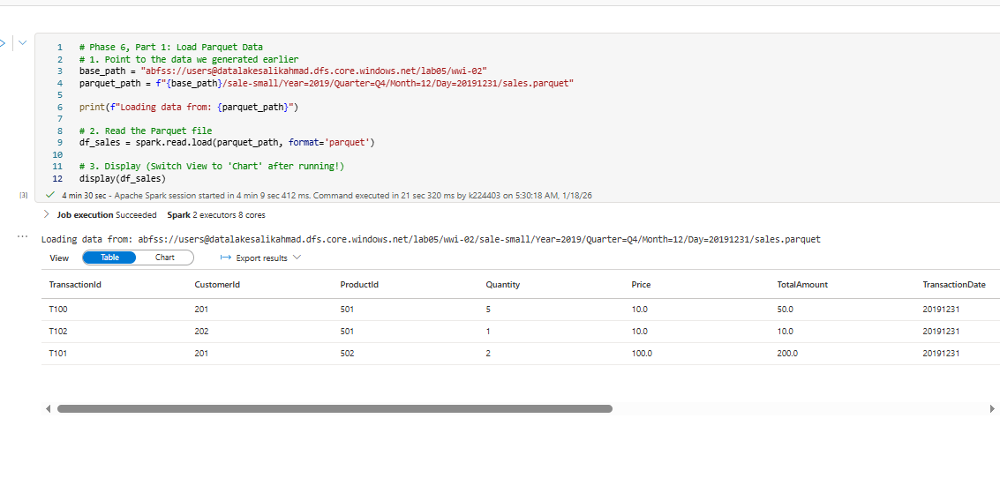
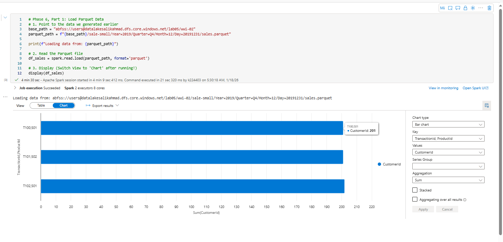
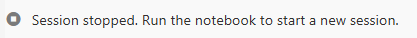

# Lab 05: Data Engineering with Azure Synapse and PySpark

## Project Overview
In this lab, I simulated a complete Data Engineering workflow using Azure Synapse Analytics. The goal was to manage the lifecycle of big data: generating raw datasets, inspecting quality, fixing corrupted files programmatically, and transforming nested structures for analysis.

---

## Step 1: Environment Setup and Configuration
- Provisioned a Dedicated SQL Pool named SQLPool01 to serve as the analytical storage layer.

*Figure 1: Configuration and creation of the Dedicated SQL Pool.*

- Navigated to the Develop Hub in Azure Synapse Studio to manage notebooks and scripts.

*Figure 2: The Develop Hub interface before creating the new notebooks.*

---

## Step 2: Data Generation
- Used a PySpark notebook to generate raw data for simulation:
	- Valid CSV files for standard processing.
	- A corrupted CSV file to simulate real-world data quality issues.
	- Parquet and JSON files to test complex data types.

*Figure 3: The Python code used to generate and save the initial datasets into the Data Lake.*

---

## Step 3: Data Quality Inspection
- Manually inspected multiple partitions of valid sales data to ensure correct formatting.
.png)
*Figure 4: Inspecting the first partition of the valid CSV file.*
.png)
*Figure 5: Inspecting the second partition to confirm consistency.*
.png)
*Figure 6: Inspecting the third partition. All healthy files displayed correct columnar structure.*

- Previewed the file sale-20170502.csv and confirmed it was corrupted (missing newline characters).
.png)
*Figure 7: The system fails to parse the corrupted CSV file, indicating the need for a programmatic fix.*

---

## Step 4: Data Cleaning and Repair
- Wrote a PySpark script to fix the corrupted file:
	- Defined a specific Schema (StructType) to enforce correct data types.
	- Reconstructed malformed rows into a clean DataFrame.

*Figure 8: Initial draft of the remediation script using PySpark.*

- Refined the script to explicitly define the schema and save the output back to the Data Lake.

*Figure 9: Finalizing the logic to overwrite the bad file with the fixed version.*

- Verified the output table, showing two distinct rows for transactions T003 and T004.

*Figure 10: The resulting table showing the cleaned data for transactions T003 and T004.*

- Performed a final verification run to ensure reproducibility and strict schema application.
.png)
*Figure 11: Final execution confirming the fix is permanent and accurate.*

- Visualized the repaired data using a chart to check TotalAmount aggregation.

*Figure 12: Bar chart visualization of the fixed dataset.*

---

## Step 5: Parquet Analysis
- Loaded sales data for December 31, 2019 using Parquet files.

*Figure 13: Code used to load the Parquet file from the Data Lake.*

- Data loaded successfully into a DataFrame, with Spark inferring correct data types for Price and Quantity.

*Figure 14: Tabular view of the loaded Parquet sales data.*

- Visualized sales distribution:

*Figure 15: Bar chart showing Total Sales grouped by ProductID.*

*Figure 16: Alternative visualization confirming the aggregation logic.*

---

## Step 6: Complex JSON Transformation
- Handled nested JSON data where user purchases were stored as arrays:
	- Used the explode function to flatten the hierarchy.

*Figure 17: The PySpark code and result showing Visitor 9529082 split into multiple rows.*

- Verified the final output to ensure every product purchase was listed as its own unique record.

*Figure 18: The final flattened table ready for analysis.*

---

## Step 7: Resource Management
- Stopped the Spark Session to release compute resources and optimize costs.

*Figure 19: Stopping the session to complete the lab.*
