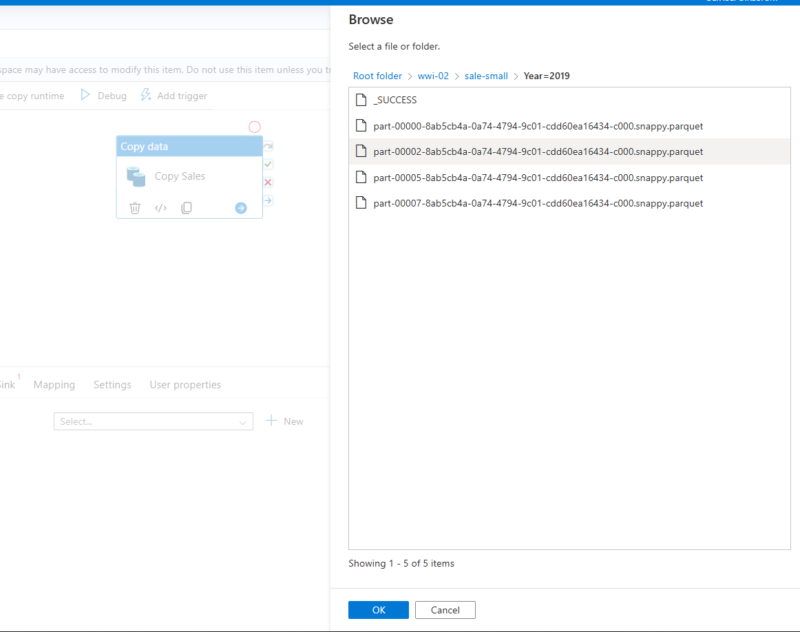
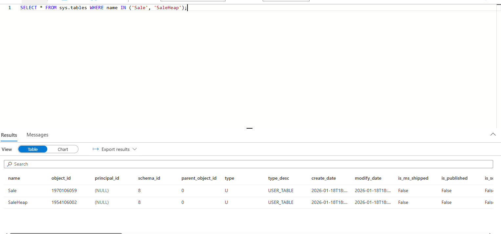
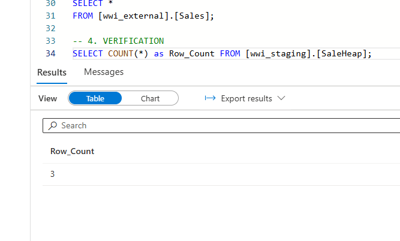

# Lab 06: Azure Synapse Data Ingestion Pipeline

## 1. Lab 6 Overview
**Objective:** Architect and deploy a scalable data pipeline within Azure Synapse Analytics to ingest sales data from a Data Lake into a Dedicated SQL Pool.
**Goal:** Automate the extraction of partitioned Parquet files (Year=2019) and load them into a staging table (`wwi_staging.SaleHeap`) using high-performance loading patterns.

---

## 2. Architecture & Data Flow
- **Source System:** Azure Data Lake Storage Gen2 (ADLS Gen2) containing Parquet files partitioned by year.
  
	

- **Orchestration:** Azure Synapse Pipelines (Copy Data Activity).
- **Staging Area:** Blob Storage Container (wwi-02) used for PolyBase/COPY command staging.
- **Destination:** Azure Synapse Dedicated SQL Pool (SQLPool01) targeting the `[wwi_staging].[SaleHeap]` table.
  
	

---

## 3. Technical Configuration

### A. Source Configuration (ADLS Gen2)
- The pipeline was configured to read from the Data Lake using a Wildcard pattern to recursively fetch all files within the specific 2019 partition folder.
	- **File Path Type:** Wildcard file path
	- **Container:** wwi-02
	- **Wildcard Folder Path:** sale-small/Year=2019
	- **Wildcard File Name:** *
  
	

### B. Sink Configuration (SQL Pool)
- The destination was set to the Dedicated SQL Pool using the COPY Command for optimal performance. A pre-copy script was implemented to clear the table before loading to prevent duplicates.
	- **Copy Method:** COPY command
	- **Pre-copy Script:** `TRUNCATE TABLE [wwi_staging].[SaleHeap]`
  
	

### C. Column Mapping
- Explicit mapping was verified to ensure the source Parquet schema (Price, TotalAmount, ProfitAmount) correctly aligned with the destination SQL table columns.
  
	

### D. Staging Settings
- To support the COPY Command, staging was enabled and directed to the workspace default storage account.
	- **Enable Staging:** Checked (Required)
	- **Storage Path:** wwi-02
  
	

---

## 4. Implementation Challenges & Resolutions

### Issue 1: Parameter Validation Errors
- **Symptom:** The pipeline failed validation with "Parameter name can't be empty" errors due to blank rows in the dataset settings.
  
	

- **Resolution:** Identified and removed empty parameter rows, resulting in a successful validation.
  
	

### Issue 2: Wildcard Path Logic
- **Symptom:** The pipeline failed because the source path was pointing to a folder without a wildcard file pattern.
  
	

- **Resolution:** Updated the source settings to explicitly include * as the wildcard file name, ensuring the pipeline could iterate through the folder contents.

### Issue 3: Incorrect SQL Pool Selection
- **Symptom:** The destination dataset returned an empty list of tables because the Linked Service was pointing to the Serverless SQL pool (Default) instead of the Dedicated Pool.
  
	
	

- **Resolution:** Switched the Linked Service to sqlpool01, which allowed the correct schema and tables to be discovered.

### Issue 4: Generic Run Failure (Staging)
- **Symptom:** The pipeline execution failed immediately upon debug without a specific error message initially, often caused by missing staging configurations for the Copy Command.
  
	
	

- **Resolution:** Enabled Staging in the Settings tab (See Section 3.D).

---

## 5. Verification & Results
- The pipeline execution was verified via a Debug run, and the data arrival was confirmed using SQL scripts.
	- **Pipeline Status:** The debug run completed successfully.
	- **Data Integrity Check:** A SQL query confirmed that rows were successfully loaded into the staging table.
  
	
  
	
